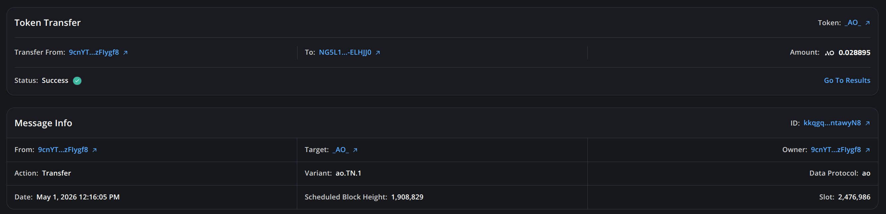
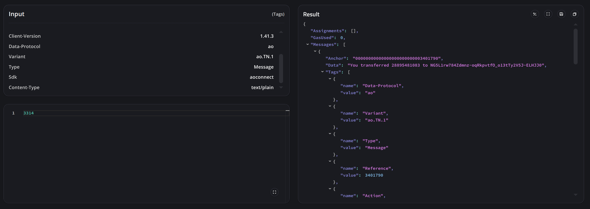

# Explorer FAQs

## Which AO network explorers are available?

- Lunar: <https://lunar.arweave.net>
- AO Link: <https://aolink.arweave.net>

Use Lunar as the primary explorer. It is maintained by the AO team and has the latest features needed to inspect AO messages correctly.

## How can I quickly inspect an AO transfer status?

Open the transfer message in Lunar:

```text
https://lunar.arweave.net/#/explorer/<TRANSFER-ID>/info
```

Check the transfer status and metadata fields, including `Status`, `Slot`, and assigned block height. `Status: Success` means the transfer message was assigned by the scheduler and computed.



The `Result` section displays the transfer compute result.



## The transfer is successful, but notices are missing. Did the transfer fail?

Not necessarily. Treat the direct transfer compute result as authoritative for the transfer.

Debit and Credit notices are post-execution output messages. If those notices are not available through GraphQL or Arweave indexing yet, that is an indexing or availability issue/delay for the notice messages -- it does not by itself mean the original transfer failed.

## Where should I check for slot number?

Use the process schedule as the source of truth for slot metadata. Explorers may display slot numbers for convenience, but integrations should not depend on explorer UI availability.
